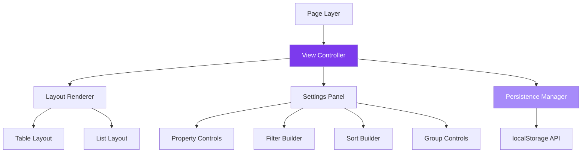
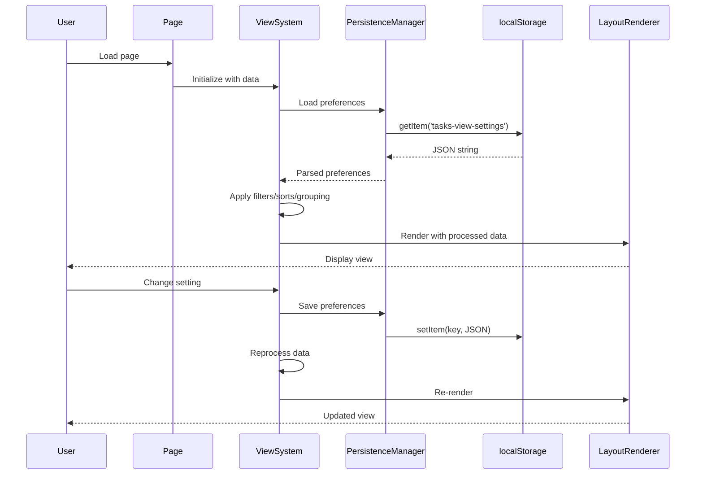

# Design Document: Notion-Style Views for Tasks and Projects

## Overview

This design document specifies the technical implementation for a comprehensive Notion-style view system that transforms the existing table-based Tasks and Projects pages into a flexible, multi-layout data presentation system. The system provides users with two distinct layout modes (Table and List), advanced view customization through a settings panel, and powerful data manipulation capabilities including property visibility controls, filtering, sorting, and grouping.

### Key Design Goals

1. **Flexible Visualization**: Enable users to switch between Table (detailed grid) and List (compact mobile-friendly) layouts while maintaining all functionality
2. **User Customization**: Provide granular control over which data properties are visible, how data is filtered, sorted, and grouped
3. **Seamless Persistence**: Automatically save all view preferences to localStorage with separate configurations for Tasks and Projects pages
4. **Performance at Scale**: Maintain 60fps scrolling and sub-300ms interactions even with 500+ items through virtualization and optimization
5. **Mobile-First Responsiveness**: Ensure perfect functionality on devices from 320px width upward with touch-optimized interactions
6. **Non-Disruptive Integration**: Preserve all existing features (modals, filters, FAB, navigation) while adding new view capabilities

### Research Summary

**localStorage State Management**: Modern React applications use the `useState` hook with lazy initialization combined with `useEffect` for automatic synchronization between component state and persistent storage ([source](https://copyprogramming.com/howto/how-do-you-persist-data-in-state-with-react-and-local-storage)). The pattern involves three steps: initializing state from localStorage on mount, updating localStorage on state changes, and handling serialization/deserialization since localStorage only stores strings. For 2026 best practices, advanced applications leverage `useSyncExternalStore` for sophisticated state synchronization across components and tabs.

**List Virtualization**: React-window is the recommended lightweight virtualization library created by Brian Vaughn from the React core team ([source](https://www.audoir.com/blog/virtualization-tutorial)). Virtualization solves performance issues by rendering only visible items plus a small buffer, preventing unnecessary rendering of thousands of DOM nodes. This technique maintains the illusion of a massive list while keeping browser performance optimal, typically rendering only 20-30 rows in the viewport at a time even when scrolling through 100,000 rows ([source](https://sathishsaravanan.com/blog/react-virtualized-performance/)).

**Notion View Architecture**: Notion database views allow users to see the same data in different ways with each view having its own filters, sorts, and layout configuration ([source](https://developers.notion.com/guides/data-apis/working-with-views)). Views are specific configurations of a database with their own set of filters, sorts, and groupings that allow users to see and interact with data in particular ways ([source](https://www.landmarklabs.co/insights/notion-database-views)).

## Architecture

### System Components

The view system consists of five primary architectural layers:



**1. Page Layer** (`app/tasks/page.tsx`, `app/projects/page.tsx`)
- Orchestrates data loading, authentication, and modal management
- Passes data and callbacks to View Controller
- Maintains existing FAB, MobileHeader, BottomNav integration

**2. View Controller** (New: `components/ViewSystem.tsx`)
- Central state management for view preferences
- Coordinates between layout renderers and settings panel
- Applies filters, sorts, and grouping to data
- Manages localStorage persistence through Persistence Manager

**3. Layout Renderer** (New: `components/layouts/`)
- **TableLayout**: Wraps existing table implementation with property visibility
- **ListLayout**: New compact layout with grouped/flat display modes

**4. Settings Panel** (New: `components/ViewSettingsPanel.tsx`)
- Modal interface for view customization
- Contains sub-components for property, filter, sort, and group controls
- Lazy-loaded to optimize initial page load

**5. Persistence Manager** (New: `lib/viewPersistence.ts`)
- Handles all localStorage operations
- Provides serialization/deserialization with validation
- Manages quota exceeded errors and data migration

### Data Flow



### Component Hierarchy

```
TasksPage / ProjectsPage
├── AppShell (Sidebar)
├── MobileHeader
├── ViewSystem (NEW)
│   ├── ViewToolbar (NEW)
│   │   ├── LayoutToggle
│   │   └── SettingsButton
│   ├── TableLayout (Enhanced existing)
│   │   └── DataTable (existing with visibility)
│   ├── ListLayout (NEW)
│   │   ├── TaskGroupList (for Tasks)
│   │   │   ├── GroupHeader (collapsible)
│   │   │   └── TaskListItem[]
│   │   └── ProjectListItem[] (for Projects)
│   └── ViewSettingsPanel (NEW, lazy-loaded)
│       ├── LayoutSection
│       ├── PropertyVisibilitySection
│       ├── FilterSection
│       │   └── FilterBuilder
│       ├── SortSection
│       │   └── SortBuilder
│       └── GroupSection (Tasks only)
├── BottomNav
├── FAB
└── Modal (existing)
```

## Components and Interfaces

### Core Interfaces

```typescript
// View preferences data structure
interface ViewPreferences {
  layout: 'table' | 'list';
  visibleColumns: string[];
  filters: FilterCondition[];
  sorts: SortRule[];
  groupBy?: 'project' | null; // Tasks only
  collapsedGroups?: string[]; // Group IDs that are collapsed
}

// Filter condition structure
interface FilterCondition {
  id: string; // Unique identifier for removal
  field: string; // Property name to filter on
  operator: 'equals' | 'not_equals' | 'contains' | 'in' | 'is_empty' | 'is_not_empty';
  value?: any; // Value to compare against (not needed for is_empty/is_not_empty)
}

// Sort rule structure
interface SortRule {
  id: string; // Unique identifier for removal
  field: string; // Property name to sort by
  direction: 'asc' | 'desc';
}

// Task group structure (for grouped list view)
interface TaskGroup {
  projectId: string;
  projectName: string;
  tasks: Task[];
  isCollapsed: boolean;
}
```

### Component Specifications

#### ViewSystem Component

**Purpose**: Central controller for view state and data processing

**Props**:
```typescript
interface ViewSystemProps {
  type: 'tasks' | 'projects';
  data: Task[] | Project[];
  currentUser?: string;
  mobileFilter: 'all' | 'mine'; // From MobileHeader
  onEdit: (id: string) => void;
  onDelete: (id: string) => void;
}
```

**State**:
```typescript
const [preferences, setPreferences] = useState<ViewPreferences>(defaultPreferences);
const [settingsPanelOpen, setSettingsPanelOpen] = useState(false);
```

**Key Methods**:
- `loadPreferences()`: Load from localStorage on mount
- `savePreferences(prefs: ViewPreferences)`: Save to localStorage immediately
- `applyFilters(data: any[])`: Filter data based on active conditions
- `applySorts(data: any[])`: Sort data based on active rules
- `applyGrouping(data: Task[])`: Group tasks by project (Tasks only)
- `toggleLayout()`: Switch between table and list layouts
- `updateVisibleColumns(columns: string[])`: Update property visibility
- `addFilter(condition: FilterCondition)`: Add new filter
- `removeFilter(id: string)`: Remove filter by ID
- `addSort(rule: SortRule)`: Add new sort rule
- `removeSort(id: string)`: Remove sort rule by ID
- `setGroupBy(value: 'project' | null)`: Set grouping mode (Tasks only)
- `toggleGroupCollapse(groupId: string)`: Toggle group collapsed state

#### ListLayout Component

**Purpose**: Render compact list view with optional grouping

**Props**:
```typescript
interface ListLayoutProps {
  type: 'tasks' | 'projects';
  data: Task[] | Project[] | TaskGroup[];
  visibleColumns: string[];
  isGrouped: boolean; // Whether data is pre-grouped
  onEdit: (id: string) => void;
  onDelete: (id: string) => void;
  onToggleGroup?: (groupId: string) => void; // For collapsible groups
}
```

**Features**:
- Virtualized rendering for 50+ items using react-window
- Compact card-based layout optimized for mobile
- Collapsible group headers (Tasks only)
- Inline quick actions (edit, delete)
- Status and priority badges
- Progress bars
- Assignee chips

#### ViewSettingsPanel Component

**Purpose**: Modal interface for view customization

**Props**:
```typescript
interface ViewSettingsPanelProps {
  type: 'tasks' | 'projects';
  preferences: ViewPreferences;
  onUpdate: (prefs: ViewPreferences) => void;
  onClose: () => void;
}
```

**Features**:
- Lazy-loaded component (not loaded until first open)
- Full-screen on mobile (<768px), modal on desktop
- Sections: Layout, Property Visibility, Filter, Sort, Group
- Auto-save on every change
- Keyboard navigation (Tab, Enter, Escape)
- Touch-friendly controls (44x44px minimum)

#### PersistenceManager Module

**Purpose**: Handle all localStorage operations with error handling

**Functions**:
```typescript
// Load preferences from localStorage
function loadViewPreferences(key: string): ViewPreferences | null

// Save preferences to localStorage
function saveViewPreferences(key: string, prefs: ViewPreferences): boolean

// Validate preferences structure
function validatePreferences(prefs: any): boolean

// Get default preferences
function getDefaultPreferences(type: 'tasks' | 'projects'): ViewPreferences

// Handle quota exceeded errors
function handleQuotaExceeded(key: string): void
```

**Error Handling**:
- Returns null for invalid JSON or missing keys
- Validates structure before returning preferences
- Logs errors to console for debugging
- Falls back to defaults on any error
- Clears old data on quota exceeded

## Data Models

### Task Data Model (Existing)

```typescript
interface Task {
  task_id: string;
  task_name: string;
  project_id: string;
  assignees: string | null; // CSV string
  status: 'Active' | 'Done' | 'Blocked' | 'Pending';
  priority: 'Urgent' | 'High' | 'Normal' | 'Low' | 'Recurring';
  progress: string; // e.g., "75%"
  due_date: string | null; // ISO date string
  notes: string | null;
  brief: string | null;
  url: string | null; // Newline-separated URLs
  version: number;
}
```

**Filterable Properties**: status, priority, assignees, due_date, project_id
**Sortable Properties**: task_name, status, priority, progress, due_date, project_id
**Visible Properties**: All properties except version (controlled by user)

### Project Data Model (Existing)

```typescript
interface Project {
  project_id: string;
  project_name: string;
  category: string;
  owner: string | null;
  assignees: string | null; // CSV string
  status: 'Active' | 'Completed' | 'On Hold' | 'Closed';
  progress: number; // 0-100
  task_count: number;
  notes: string | null;
  brief: string | null;
  url: string | null; // Newline-separated URLs
  version: number;
}
```

**Filterable Properties**: status, category, owner, assignees
**Sortable Properties**: project_name, category, status, progress, task_count
**Visible Properties**: All properties except version (controlled by user)

### View Preferences Storage Model

**localStorage Keys**:
- Tasks: `tasks-view-settings`
- Projects: `projects-view-settings`

**Storage Format**:
```json
{
  "layout": "list",
  "visibleColumns": ["name", "status", "priority", "progress", "due_date", "assignees"],
  "filters": [
    {
      "id": "filter-1",
      "field": "status",
      "operator": "equals",
      "value": "Active"
    }
  ],
  "sorts": [
    {
      "id": "sort-1",
      "field": "priority",
      "direction": "desc"
    }
  ],
  "groupBy": "project",
  "collapsedGroups": ["PROJ-001", "PROJ-003"]
}
```

**Default Preferences**:

Tasks:
```json
{
  "layout": "table",
  "visibleColumns": ["name", "status", "priority", "progress", "due_date", "assignees", "notes", "brief", "url", "project_id"],
  "filters": [],
  "sorts": [],
  "groupBy": "project",
  "collapsedGroups": []
}
```

Projects:
```json
{
  "layout": "table",
  "visibleColumns": ["name", "category", "status", "progress", "task_count", "assignees", "owner", "notes", "brief", "url"],
  "filters": [],
  "sorts": [],
  "collapsedGroups": []
}
```

### Filter Operators Logic

```typescript
function applyFilterOperator(value: any, operator: string, filterValue: any): boolean {
  switch (operator) {
    case 'equals':
      return value === filterValue;
    case 'not_equals':
      return value !== filterValue;
    case 'contains':
      return String(value || '').toLowerCase().includes(String(filterValue).toLowerCase());
    case 'in':
      // filterValue is array, check if value is in array
      return Array.isArray(filterValue) && filterValue.includes(value);
    case 'is_empty':
      return value === null || value === undefined || value === '';
    case 'is_not_empty':
      return value !== null && value !== undefined && value !== '';
    default:
      return true;
  }
}
```

### Sort Comparison Logic

```typescript
function compareValues(a: any, b: any, direction: 'asc' | 'desc'): number {
  // Handle null/undefined
  if (a === null || a === undefined) return direction === 'asc' ? 1 : -1;
  if (b === null || b === undefined) return direction === 'asc' ? -1 : 1;
  
  // Handle numbers (including progress percentages)
  const aNum = typeof a === 'string' ? parseFloat(a.replace('%', '')) : a;
  const bNum = typeof b === 'string' ? parseFloat(b.replace('%', '')) : b;
  
  if (!isNaN(aNum) && !isNaN(bNum)) {
    return direction === 'asc' ? aNum - bNum : bNum - aNum;
  }
  
  // Handle strings
  const aStr = String(a).toLowerCase();
  const bStr = String(b).toLowerCase();
  
  if (direction === 'asc') {
    return aStr < bStr ? -1 : aStr > bStr ? 1 : 0;
  } else {
    return aStr > bStr ? -1 : aStr < bStr ? 1 : 0;
  }
}
```


## Correctness Properties

*A property is a characteristic or behavior that should hold true across all valid executions of a system—essentially, a formal statement about what the system should do. Properties serve as the bridge between human-readable specifications and machine-verifiable correctness guarantees.*

### Property 1: View Preferences Serialization Round-Trip

*For any* valid ViewPreferences object, serializing to JSON then deserializing back to an object SHALL produce an equivalent ViewPreferences object with all fields and values preserved.

**Validates: Requirements 1.3, 2.8, 5.8, 6.11, 7.10, 16.5**

This property ensures that all view settings (layout mode, visible columns, filters, sorts, grouping, collapsed groups) are correctly persisted to and restored from localStorage without data loss or corruption.

### Property 2: Layout Switching Preserves Settings

*For any* ViewPreferences object with active filters, sorts, and grouping settings, switching the layout mode from table to list or list to table SHALL preserve all other settings unchanged (filters, sorts, groupBy, collapsedGroups, visibleColumns remain identical).

**Validates: Requirements 1.7**

This property ensures that changing the visual presentation mode does not inadvertently clear or modify the user's data manipulation settings.

### Property 3: Filter Application Produces Valid Subset

*For any* dataset and any FilterCondition, applying the filter SHALL produce a result set that is a subset of or equal to the original dataset (len(filtered) <= len(original)) AND every item in the result set SHALL satisfy the filter condition.

**Validates: Requirements 6.8**

This property ensures that filtering never adds items and only includes items that match the specified condition.

### Property 4: Multiple Filters Use AND Logic

*For any* dataset and any set of multiple FilterConditions, applying all filters SHALL produce a result set where every item satisfies ALL filter conditions (intersection semantics), and the result SHALL be a subset of applying any single filter individually.

**Validates: Requirements 6.12**

This property ensures that multiple filters narrow the result set progressively and that the combination is more restrictive than any individual filter.

### Property 5: Sort Order Satisfaction

*For any* dataset and any SortRule with direction 'asc', the sorted result SHALL satisfy the property that for each adjacent pair of items (item[i], item[i+1]), the value of the sort field in item[i] is less than or equal to the value in item[i+1]. For direction 'desc', the inequality SHALL be reversed (greater than or equal to).

**Validates: Requirements 7.7**

This property ensures that sorting produces a correctly ordered sequence according to the specified field and direction.

### Property 6: Sort Preserves All Items

*For any* dataset and any SortRule, sorting SHALL preserve all items from the original dataset (no items added or removed), and the sorted result SHALL contain exactly the same items as the original (same length, same items when compared as sets).

**Validates: Requirements 7.7**

This property ensures that sorting is a pure reordering operation that doesn't lose or duplicate data.

### Property 7: Multi-Level Sort Stability

*For any* dataset and any sequence of two or more SortRules, applying the sorts SHALL produce a result where items are primarily ordered by the first sort rule, and items with equal values for the first sort field are ordered by the second sort rule, and so on. The result SHALL be stable (items equal on all sort fields maintain their original relative order).

**Validates: Requirements 7.11, 7.12**

This property ensures that multi-level sorting correctly applies secondary and tertiary sort criteria only when primary criteria produce ties.

### Property 8: Task Grouping Completeness and Disjointness

*For any* list of tasks, grouping by project_id SHALL produce groups where:
1. The union of all tasks across all groups equals the original task list (completeness)
2. No task appears in more than one group (disjointness)
3. All tasks within a group have the same project_id value (invariant)
4. Groups are sorted by project_id in ascending order

**Validates: Requirements 2.1, 2.10, 8.6, 8.7**

This property ensures that grouping correctly partitions the task set without losing or duplicating tasks, and that groups are properly ordered.

### Property 9: Visible Columns Count Matches Selection

*For any* set of property visibility selections (checked properties), the number of visible columns in the rendered view SHALL equal the number of checked properties, and each visible column SHALL correspond to exactly one checked property.

**Validates: Requirements 5.5**

This property ensures that the visibility controls accurately reflect what is displayed in the view.

### Property 10: Filter Idempotence

*For any* dataset and any FilterCondition, applying the same filter twice SHALL produce the same result as applying it once (filter(filter(data, condition), condition) === filter(data, condition)).

**Validates: Requirements 6.8**

This property ensures that filters are idempotent operations that reach a stable state after one application.

### Property 11: Sort Idempotence

*For any* dataset and any SortRule, sorting the same data twice with the same rule SHALL produce the same result as sorting it once (sort(sort(data, rule), rule) === sort(data, rule)).

**Validates: Requirements 7.7**

This property ensures that sorting is idempotent and produces a stable ordering.

## Error Handling

### localStorage Errors

**Unavailable localStorage**:
- Detect: Try-catch around `localStorage.getItem()` and `localStorage.setItem()`
- Fallback: Use in-memory state with `useState` only
- User Feedback: Display warning toast: "Settings cannot be saved (localStorage unavailable)"
- Behavior: All features work normally but settings reset on page reload

**Quota Exceeded**:
- Detect: Catch `QuotaExceededError` on `localStorage.setItem()`
- Recovery: Clear old view settings keys, retry save operation
- User Feedback: Display info toast: "Storage limit reached, cleared old settings"
- Logging: Log to console with details about cleared keys

**Corrupted Data**:
- Detect: JSON.parse() throws error or validation fails
- Recovery: Use default preferences for that page
- Logging: Log error to console with corrupted data sample
- Behavior: Silently fall back to defaults without user interruption

### Data Processing Errors

**Invalid Filter Values**:
- Detect: Filter value is null/undefined when operator requires a value
- Handling: Skip that filter condition, log warning
- User Feedback: Display warning in settings panel: "Invalid filter ignored"

**Invalid Sort Fields**:
- Detect: Sort field doesn't exist on data objects
- Handling: Skip that sort rule, log warning
- User Feedback: Display warning in settings panel: "Invalid sort field ignored"

**Empty Result Sets**:
- Detect: After applying filters, result array is empty
- Handling: Display empty state message: "No items match your filters"
- User Action: Provide "Clear filters" button in empty state

**Missing Project Data for Grouping**:
- Detect: Task has null/undefined project_id when grouping is active
- Handling: Create "Unassigned" group for tasks without project_id
- Display: Show "Unassigned" group at the end of the list

### Integration Errors

**Modal Fails to Open**:
- Detect: onEdit callback throws error
- Handling: Catch error, display error toast
- User Feedback: "Failed to open editor. Please try again."
- Logging: Log error with task/project ID

**Delete Operation Fails**:
- Detect: onDelete callback throws error or returns error
- Handling: Catch error, display error toast
- User Feedback: "Failed to delete item. Please try again."
- Behavior: Do not remove item from view until confirmed deleted

**Data Refresh Fails**:
- Detect: Data prop becomes null/undefined after being populated
- Handling: Show loading state, retry data fetch
- User Feedback: Display loading spinner with "Refreshing data..."
- Timeout: After 10 seconds, show error state with retry button

## Testing Strategy

### Dual Testing Approach

This feature requires both **property-based testing** for core logic and **example-based testing** for UI components and integration points.

#### Property-Based Testing (PBT)

**Applicable Areas**:
- Filtering logic (subset properties, AND logic, idempotence)
- Sorting logic (order satisfaction, preservation, stability, idempotence)
- Grouping logic (completeness, disjointness, invariants)
- Serialization (round-trip properties)
- Property visibility (count matching)

**Library**: Use `fast-check` for TypeScript/JavaScript property-based testing

**Configuration**:
- Minimum 100 iterations per property test
- Each test must reference its design property in a comment
- Tag format: `// Feature: notion-style-views, Property N: [property text]`

**Example Property Test Structure**:
```typescript
// Feature: notion-style-views, Property 3: Filter Application Produces Valid Subset
test('filter produces valid subset', () => {
  fc.assert(
    fc.property(
      fc.array(taskGenerator()),
      filterConditionGenerator(),
      (tasks, filter) => {
        const filtered = applyFilter(tasks, filter);
        // Subset property
        expect(filtered.length).toBeLessThanOrEqual(tasks.length);
        // All match property
        filtered.forEach(task => {
          expect(matchesFilter(task, filter)).toBe(true);
        });
      }
    ),
    { numRuns: 100 }
  );
});
```

**Generators Needed**:
- `taskGenerator()`: Generate random tasks with all fields
- `projectGenerator()`: Generate random projects with all fields
- `filterConditionGenerator()`: Generate random filter conditions
- `sortRuleGenerator()`: Generate random sort rules
- `viewPreferencesGenerator()`: Generate random view preferences objects

#### Example-Based Unit Testing

**Applicable Areas**:
- UI component rendering (ListLayout, ViewSettingsPanel, badges, progress bars)
- User interactions (button clicks, checkbox toggles, modal open/close)
- Edge cases (empty data, single item, all items filtered out)
- Error handling (localStorage unavailable, invalid JSON, quota exceeded)
- Default configurations (default preferences, default visible columns)

**Library**: Use Jest with React Testing Library

**Key Test Scenarios**:
1. Layout toggle switches between table and list views
2. Settings panel opens and closes correctly
3. Property checkboxes control column visibility
4. Filter chips display and remove correctly
5. Sort chips display with direction indicators
6. Group headers collapse and expand
7. Empty state displays when no items match filters
8. Error toast displays when localStorage is unavailable
9. Default preferences load when no saved settings exist
10. Quick actions (edit, delete) trigger correct callbacks

#### Integration Testing

**Applicable Areas**:
- Integration with existing Modal component
- Integration with existing MobileHeader filters
- Integration with FAB, BottomNav, Sidebar
- Combined MobileHeader + ViewSettings filters (AND logic)
- Data loading and refresh with view settings active
- Mobile responsiveness (320px, 390px, 768px, 1024px viewports)

**Test Scenarios**:
1. MobileHeader "My Tasks" filter + ViewSettings status filter both apply
2. Clicking edit in list view opens Modal with correct task
3. Deleting item from list view triggers confirmation and removes item
4. FAB creates new item that appears in current view (if matches filters)
5. View settings persist across page navigation (Tasks → Projects → Tasks)
6. Settings panel is usable on mobile (touch targets, scrolling, full-screen)

#### Performance Testing

**Applicable Areas**:
- Initial render time with varying dataset sizes (10, 50, 100, 500 items)
- Filter application time (measure time to update view)
- Sort application time (measure time to reorder view)
- Scroll performance in list view (measure FPS during scroll)
- localStorage save/load time (measure persistence operations)

**Performance Targets** (from requirements):
- Initial render: <500ms for 100 items, <1000ms for 500 items
- Filter/sort update: <300ms for 100 items
- Scroll performance: 60fps with 100+ items
- localStorage save: <100ms

**Test Approach**:
- Use performance.now() to measure operation times
- Use React DevTools Profiler for render performance
- Use browser DevTools Performance tab for scroll FPS
- Test with representative datasets, not property-based testing

#### Accessibility Testing

**Applicable Areas**:
- Keyboard navigation (Tab, Enter, Space, Escape)
- Screen reader announcements (ARIA labels, live regions)
- Focus management (modal open/close, panel open/close)
- Color contrast (WCAG AA compliance)
- Touch target sizes (minimum 44x44px)

**Test Approach**:
- Automated: Use jest-axe for accessibility violations
- Manual: Test with keyboard only (no mouse)
- Manual: Test with screen reader (NVDA, JAWS, VoiceOver)
- Manual: Verify color contrast with browser DevTools
- Manual: Test on touch device for target sizes

**Note**: Full WCAG compliance validation requires manual testing with assistive technologies and expert accessibility review.

### Test Coverage Goals

- **Property-based tests**: 100% coverage of filtering, sorting, grouping, serialization logic
- **Unit tests**: 90%+ coverage of UI components and utility functions
- **Integration tests**: Cover all major user workflows (10-15 scenarios)
- **Performance tests**: Verify all performance targets from requirements
- **Accessibility tests**: Zero automated violations, manual verification of keyboard/screen reader

### Testing Priority

1. **Critical (Must have before release)**:
   - Property tests for filtering, sorting, serialization
   - Unit tests for core components (ViewSystem, ListLayout)
   - Integration tests for Modal, delete, filter combination
   - Basic accessibility tests (keyboard navigation, ARIA labels)

2. **Important (Should have before release)**:
   - Property tests for grouping, multi-level sort
   - Unit tests for settings panel, filter/sort builders
   - Performance tests for 100+ items
   - Mobile responsiveness tests

3. **Nice to have (Can be added post-release)**:
   - Edge case unit tests for all error scenarios
   - Performance tests for 500+ items
   - Comprehensive accessibility manual testing
   - Visual regression tests for styling

